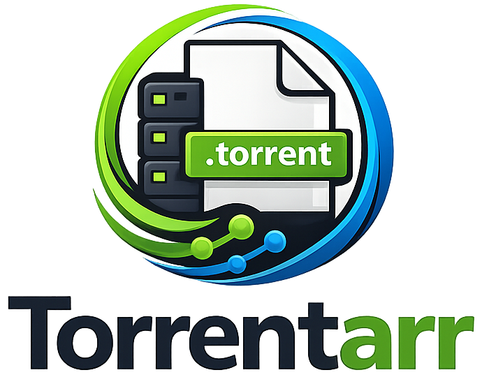
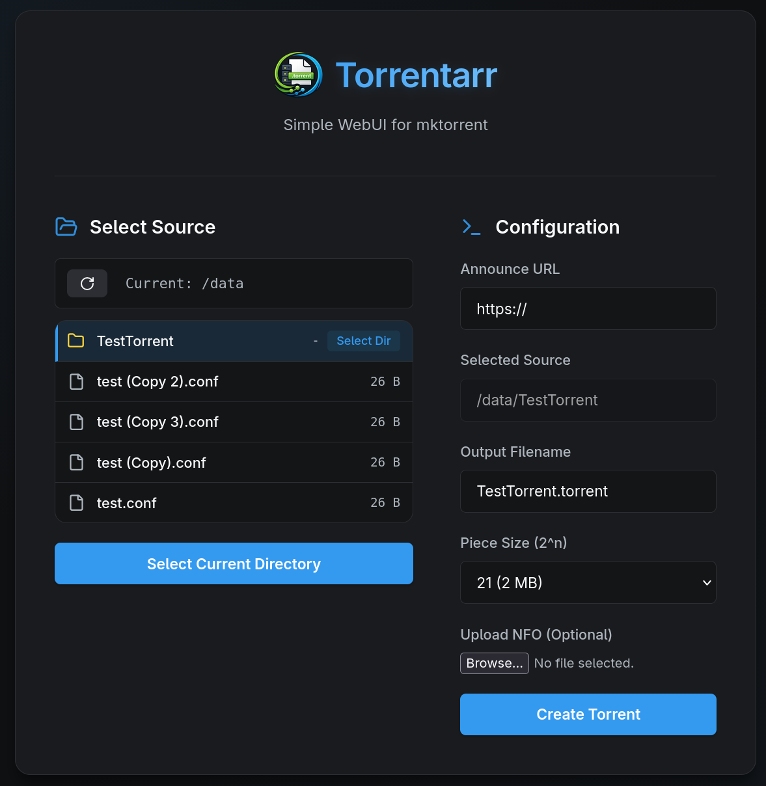

# Torrentarr

A lightweight, Dockerized WebUI for `mktorrent`. Generate `.torrent` files directly from your browser with a simple, modern interface.





## Features

-   **Web Interface**: Clean, responsive, and dark-themed UI for creating torrents.
-   **File Browser**: Navigate your server's filesystem to select source files/directories.
-   **Automatic NFO**: Upload NFO files automatically during creation.
-   **Direct Download**: Download the generated `.torrent` file immediately.
-   **Dockerized**: Built on Alpine Linux for a minimal footprint.

## Prerequisite

-   Docker installed on your system.
-   A directory with files you want to turn into torrents.

## Installation & Usage

### 1. Get the Image

**Option A: Pull from GitHub Container Registry**

```bash
docker pull ghcr.io/4sitam4/torrentarr:latest
```

**Option B: Build Locally**

Run the following command in the root directory (where the `Dockerfile` is located):

```bash
docker build -t torrentarr .
```

### 2. Run the Container

You need to mount your data directory (where source files are) and an output directory (where `.torrent` files will be saved).

```bash
docker run -d \
  -p 3000:3000 \
  -v /path/to/your/data:/data \
  -v /path/to/output:/output \
  --name torrentarr \
  torrentarr
```

-   Replace `/path/to/your/data` with the actual path to your files.
-   Replace `/path/to/output` with the path where you want the .torrent files to be saved.

### 3. Docker Compose (Optional)

If you prefer using `docker-compose`, add this to your `docker-compose.yml`:

```yaml
services:
  torrentarr:
    image: ghcr.io/4sitam4/torrentarr:latest
    container_name: torrentarr
    ports:
      - "3000:3000"
    volumes:
      - /path/to/your/data:/data
      - /path/to/output:/output
    environment:
      - PUID=1000 # Optional: User ID
      - PGID=1000 # Optional: Group ID
    restart: unless-stopped
```

### 4. Access the UI

Open your browser and navigate to:

```
http://localhost:3000
```

## Development

### Backend
The backend is a Node.js Express server that handles:
-   Filesystem browsing
-   `mktorrent` execution
-   Serving the frontend static files

### Frontend
The frontend is built with React + Vite.

To run locally (without Docker):

1.  **Backend**:
    ```bash
    cd backend
    npm install
    npm start
    ```
2.  **Frontend**:
    ```bash
    cd frontend
    npm install
    npm run dev
    ```

## Environment Variables

| Variable | Default   | Description |
| -------- | --------- | ----------- |
| `PORT`   | `3000`    | Port to run the server on |
| `DATA_DIR`| `/data`  | Root directory for file browser |
| `OUTPUT_DIR`| `/output`| Directory to save generated torrents |
